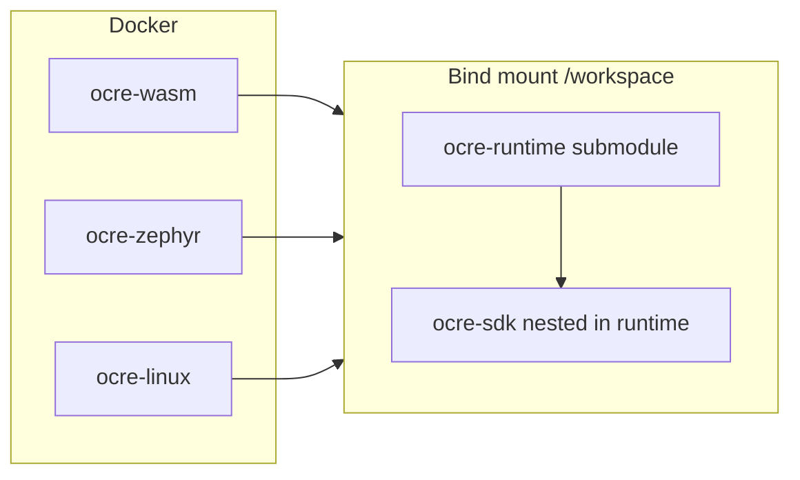
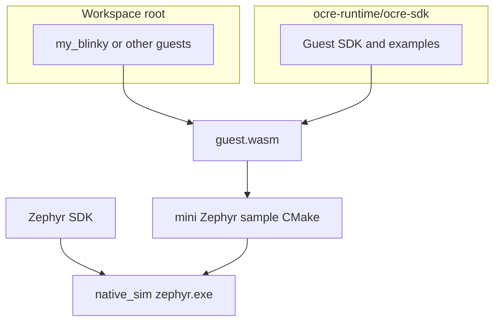

# Ocre / Zephyr workspace template

This repository is a small workspace for building **Ocre guest WASM** modules, running the **Ocre runtime on Zephyr** (`native_sim`, no hardware), and building the **Linux** posix sample—all via Docker.

## Clone and submodules

There is **one** top-level submodule, [`ocre-runtime`](./ocre-runtime) ([project-ocre/ocre-runtime](https://github.com/project-ocre/ocre-runtime)), which contains nested submodules (`ocre-sdk`, `wasm-micro-runtime`, `tests/Unity`, and others).

Clone with everything initialized:

```bash
git clone --recurse-submodules <repo-url>
cd ocre-workspace
```

If you already cloned without submodules:

```bash
git submodule update --init --recursive
```

Re-run `git submodule update --init --recursive` after pulling updates. See the [Git submodule documentation](https://git-scm.com/book/en/v2/Git-Tools-Submodules) for details.

## Workspace layout

| Path | Role |
|------|------|
| [`ocre-runtime/`](./ocre-runtime) | West manifest + Ocre runtime sources (submodule). Guest examples live under `ocre-runtime/ocre-sdk/generic/...`. |
| [`my_blinky/`](./my_blinky/) | Example standalone guest app at the workspace root (optional pattern for your own WASM apps). |

Docker Compose defines **three** services ([`compose.yml`](./compose.yml)):

| Service | Image | Purpose |
|---------|--------|---------|
| **ocre-wasm** | WASI SDK ([`Dockerfile.sdk`](./Dockerfile.sdk)) | Build `.wasm` guests with CMake. |
| **ocre-zephyr** | [`zephyr-build:v0.29.2`](./Dockerfile.zephyr) | `west` + Zephyr SDK matching Ocre’s Zephyr 4.4 line; build/run **`native_sim`** (no HIL). |
| **ocre-linux** | Ubuntu 22.04 ([`Dockerfile.linux`](./Dockerfile.linux)) | Native CMake build of the posix Ocre samples. |



## Start the environment

```bash
cd ocre-workspace
docker compose up -d --remove-orphans
docker ps
```

Shells:

```bash
docker exec -it ocre-wasm bash
docker exec -it ocre-zephyr bash
docker exec -it ocre-linux bash
```

The Zephyr container runs [`scripts/entrypoint-dev.sh`](./scripts/entrypoint-dev.sh): migrates an old west manifest path `application` → `ocre-runtime` if needed, runs `west init -l /workspace/ocre-runtime` and `west update` when `.west/` is missing, runs **`west zephyr-export` on every start**, and installs `littlefs-python` for the Ocre module. The first start can take a long time; watch `docker logs ocre-zephyr` until you see `West workspace initialized successfully`.

To **fully reset** the west workspace (for example after renaming directories or fixing a broken `west update`), delete `.west/` and the top-level `build/` folder, then restart `ocre-zephyr`. If Docker created them as root, from the host you can run:

```bash
docker run --rm -v "$(pwd)":/w alpine:latest rm -rf /w/.west /w/build
docker compose up -d ocre-zephyr --force-recreate
```

After upgrading this template, run `west update` once inside `ocre-runtime` (or from the Zephyr container: `cd /workspace/ocre-runtime && west update`) so the Zephyr tree matches [`ocre-runtime/west.yml`](./ocre-runtime/west.yml).

Check Zephyr (note: `ZEPHYR_BASE` is set only after sourcing the env script):

```bash
docker exec -it ocre-zephyr bash -lc 'source /workspace/zephyr/zephyr-env.sh && echo "$ZEPHYR_BASE"'
```

## Quick validation (copy-paste)

After `docker compose build` (or at least `docker compose build ocre-zephyr` when you change the Zephyr Dockerfile):

```bash
cd ocre-workspace
docker compose up -d --remove-orphans
```

1. **Wait for west** (first start can take many minutes). Until you see a success line, Zephyr builds will fail:

```bash
docker logs -f ocre-zephyr
# look for: West workspace initialized successfully
# Ctrl+C when you see it (or Sourcing Zephyr environment after a successful update)
```

2. **WASM guest** (optional if you only test the default Zephyr image):

```bash
docker exec ocre-wasm bash -lc 'cd /workspace/ocre-runtime/ocre-sdk/generic/blinky && mkdir -p build && cd build && cmake .. && make'
```

3. **Zephyr `native_sim`** — build once, then run. The run step **keeps the simulator process alive** (like a board firmware loop); stop with **Ctrl+C** or wrap in `timeout`:

```bash
docker exec -it ocre-zephyr bash -lc 'source /workspace/zephyr/zephyr-env.sh && cd /workspace && west build -p always -b native_sim ocre-runtime/src/samples/mini/zephyr'
docker exec -it ocre-zephyr bash -lc 'source /workspace/zephyr/zephyr-env.sh && cd /workspace/build && timeout 15s west build -t run'
```

Use the first `west build` **without** `-- -DOCRE_INPUT_FILE=...` to use the sample’s bundled `hello-world.wasm` (most reliable). Add `OCRE_INPUT_FILE` only when you intentionally inject another `.wasm`.

4. **Linux posix mini**:

```bash
docker exec ocre-linux bash -lc 'cd /workspace/ocre-runtime && git submodule update --init --recursive && rm -rf build && mkdir build && cd build && cmake .. -DCMAKE_BUILD_TYPE=Release -DOCRE_BUILD_DEMO_CONTAINERS=OFF && make -j$(nproc) ocre_mini && timeout 5s ./src/samples/mini/posix/ocre_mini'
```

If **Zephyr “does not respond”**, it is usually either (a) **`west update` still running**—check `docker logs ocre-zephyr`, or (b) **`west build -t run` waiting in the foreground**—use `timeout` or an interactive `docker exec -it` and Ctrl+C.

## Build a guest WASM (nested `ocre-sdk` examples)

Use **ocre-wasm**:

```bash
docker compose up -d
docker exec -it ocre-wasm bash
cd /workspace/ocre-runtime/ocre-sdk/generic/blinky
mkdir -p build && cd build
cmake ..
make
```

The artifact is `blinky.wasm` in that `build` directory.

## Build and run on Zephyr (`native_sim`, no board)

Use **ocre-zephyr** after WASM is built (or rely on the sample default `hello-world.wasm` by omitting `OCRE_INPUT_FILE`).

From the **west workspace root** (`/workspace`), build the mini Zephyr sample with an explicit guest image, then run the simulator:

```bash
docker exec -it ocre-zephyr bash
cd /workspace
west build -p always -b native_sim ocre-runtime/src/samples/mini/zephyr -- \
  -DOCRE_INPUT_FILE=/workspace/ocre-runtime/ocre-sdk/generic/blinky/build/blinky.wasm
cd build
west build -t run
```

To use the bundled default container instead, drop the `-- -DOCRE_INPUT_FILE=...` arguments.

## Build and run on Linux (posix mini)

Use **ocre-linux** (not the Zephyr container). [WASI-SDK](https://github.com/WebAssembly/wasi-sdk) is not required for the host `ocre_mini` binary; the image installs CMake, a compiler, and `llvm-dev` for the WAMR/AOT pieces pulled in by the runtime CMake.

```bash
docker exec -it ocre-linux bash
cd /workspace/ocre-runtime
git submodule update --init --recursive
rm -rf build && mkdir build && cd build
cmake .. -DCMAKE_BUILD_TYPE=Release -DOCRE_BUILD_DEMO_CONTAINERS=OFF
make -j"$(nproc)"
./src/samples/mini/posix/ocre_mini
```

`-DOCRE_BUILD_DEMO_CONTAINERS=OFF` skips embedding extra WASI demo containers (which expect a full WASI SDK in this image). The mini sample still bundles the default `hello-world.wasm`.

## Your own guest app (`my_blinky`)

[`my_blinky/CMakeLists.txt`](./my_blinky/CMakeLists.txt) points at `../ocre-runtime/ocre-sdk/ocre-sdk` for the Ocre API static library.

Build in **ocre-wasm**:

```bash
docker exec -it ocre-wasm bash
cd /workspace/my_blinky
mkdir -p build && cd build
cmake ..
make
```

Then build Zephyr mini with your wasm (same pattern as blinky, adjust the path):

```bash
docker exec -it ocre-zephyr bash
cd /workspace
west build -p always -b native_sim ocre-runtime/src/samples/mini/zephyr -- \
  -DOCRE_INPUT_FILE=/workspace/my_blinky/build/my_blinky.wasm
cd build && west build -t run
```



## Contributing

Pull requests are welcome. For major changes, please open an issue first to discuss what you would like to change.

Please make sure to update tests as appropriate.

## License

[Apache 2.0](http://www.apache.org/licenses/)
